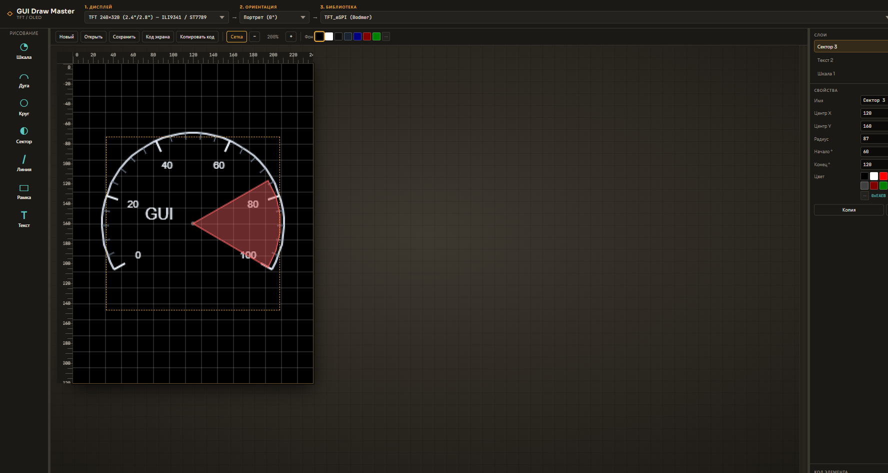
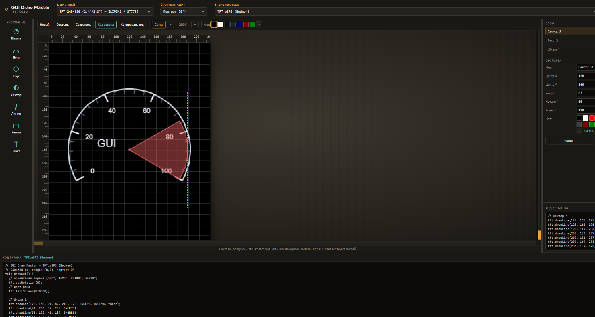

# GUI Draw Master

**Offline visual editor for TFT / OLED GUIs** — design in pixels, get ready-to-paste drawing code for popular Arduino / ESP libraries.

Idea & author: **[LivekH](https://github.com/LivekH)**

Веб-редактор интерфейсов для цветных TFT и монохромных OLED-дисплеев.  
Холст в **пикселях** с началом координат `(0, 0)`.  
Цель — меньше «прошивок наугад»: вы двигаете элементы на экране и сразу видите команды API выбранной библиотеки.

> Open source (MIT). Работает в браузере, без установки Node/.NET (нужен только локальный HTTP-сервер или любой static host).

---

## Скриншоты

Редактор (шкала + сектор + текст на TFT 240×320, TFT_eSPI):



Панель **«Код экрана»** — готовый `drawGui()`:



---

## Зачем это нужно

На микроконтроллере рисование обычно выглядит так: `drawLine`, `fillRect`, `drawCircle`, `setCursor` + `print`…  
Координаты и цвета (RGB565) приходится подбирать вручную, каждый раз заливая прошивку на плату.

**GUI Draw Master** даёт:

1. Выбрать **дисплей** (разрешение / контроллер)
2. Выбрать **ориентацию** (`setRotation` 0…3)
3. Выбрать **библиотеку** (TFT_eSPI, Adafruit GFX, U8g2, …)
4. Нарисовать GUI мышкой
5. Скопировать готовый `drawGui()` с комментариями по элементам

---

## Возможности

### Проект и экран
- Пресеты **OLED** (монохром и цвет) и **TFT** (от 80×160 до 800×480, в т.ч. **4″ ST7796 320×480**) + свой размер
- Ориентации: портрет / альбом / 180° / 270° → в коде `setRotation(...)` (или аналог библиотеки)
- Цвет фона экрана (палитра + свой цвет), по умолчанию чёрный
- Сохранение / открытие проекта в **JSON**

### Рисование
| Инструмент | Описание |
|------------|----------|
| **Шкала** | Дуга, major/minor деления и цифры — по отдельным галочкам; инверсия шкалы; режим/высота шрифта |
| **Дуга** | Дуга по углам начала/конца, толщина, цвет |
| **Круг** | Контур или заливка |
| **Сектор** | Цветовая зона от центра («красная зона» прибора) |
| **Линия** | Отрезок с толщиной (TFT_eSPI / LovyanGFX → `drawWideLine`, иначе эмуляция) |
| **Рамка** | Прямоугольник: контур или заливка |
| **Текст** | Надпись; `setTextSize` + высота в редакторе |

### Редактор
- Пиксельные **линейки**, **сетка**, зум, ползунки прокрутки
- Панорама: Alt+ЛКМ или СКМ; Ctrl+колесо — зум
- Координаты курсора **x / y** внизу рабочей области
- **Слои** с глазиком (скрыть/показать элемент)
- **Группы**: выделить несколько элементов → «Группа» (например «Вольтметр»); копирование группы целиком
- При наложении: **повторный клик** в том же месте выбирает следующий элемент под курсором
- Кнопки **центр** у Центр X / Центр Y (удобно после смены ориентации)
- Подсказки: наведи курсор на пункт ~10 с
- Изменяемая ширина боковых панелей; панель **«Код экрана»** по кнопке

### Генерация кода
- Live-код выбранного элемента и полный `drawGui()`
- Комментарии по **имени** элемента; группы — блоки `===== группа: … =====`
- Скрытые слои в код **не** попадают
- Где библиотека умеет: **`drawArc` / `fillArc`** (TFT_eSPI, LovyanGFX, Arduino_GFX, U8g2…), иначе эмуляция линиями
- Ориентация + фон; цвета **RGB565** или mono для OLED

---

## Поддерживаемые библиотеки

Список фильтруется по типу выбранного дисплея (OLED / TFT).

| Библиотека | Примечание |
|------------|------------|
| Adafruit GFX (+ ST77xx / ILI9341 / …) | Базовый API `draw*` / `fill*` |
| Adafruit SSD1306 / SH110X | OLED mono |
| Adafruit SSD1351 / SSD1331 | OLED color |
| **TFT_eSPI** (Bodmer) | `drawArc`, `drawWideLine` |
| Arduino_GFX | `drawArc` / `fillArc` |
| LovyanGFX | `drawArc` / `fillArc`, широкие линии |
| MCUFRIEND_kbv | Shield-дисплеи (дуги — эмуляция линиями) |
| UTFT | Цвет R,G,B; дуги — эмуляция |
| U8g2 / U8x8 | OLED/LCD; U8g2 — `drawArc` |
| ThingPulse SSD1306Wire | ESP OLED |
| Tiny4kOLED | Компактный OLED |
| LVGL | Заготовки/комментарии под draw API |
| Ucglib | `drawArc` |

> Точность вызовов для «редких» библиотек может отличаться — правьте под свою версию драйвера. Ядро (GFX / TFT_eSPI / U8g2) покрыто лучше всего.

---

## Запуск

### Windows
1. Дважды щёлкните **`GUI master.bat`**
2. Откроется браузер: http://127.0.0.1:8765/

Нужен Python в PATH (или Inkscape Python — bat подхватит его автоматически).

### Любая ОС (вручную)
Из папки проекта:

```bash
python -m http.server 8765
```

Откройте в браузере: http://127.0.0.1:8765/

> Файл `index.html` лучше не открывать через `file://` — ES-модули могут не загрузиться. Нужен простой HTTP-сервер.

### GitHub Pages
Можно включить Pages на ветку с `index.html` в корне — редактор будет доступен по URL репозитория.

---

## Как пользоваться (кратко)

1. Сверху: **Дисплей → Ориентация → Библиотека**
2. Слева: добавить элемент (шкала, дуга, …)
3. На холсте: перетащить; справа — свойства
4. Собрать прибор: **Ctrl+клик** по слоям → **Группа** → имя (например «Вольтметр»)
5. **Код экрана** — скопировать `drawGui()` в скетч
6. **Сохранить** — JSON, чтобы не потерять работу после обновления страницы

### Горячие клавиши

| Действие | Клавиши |
|----------|---------|
| Удалить | `Delete` / `Backspace` |
| Дублировать (в т.ч. группу) | `Ctrl+D` (не закладки браузера; работает и на русской раскладке) |
| Создать группу | `Ctrl+G` |
| Мультивыбор | `Ctrl` + клик |
| Следующий элемент под курсором | повторный клик в том же месте |
| Зум | `Ctrl` + колесо |
| Панорама | `Alt` + ЛКМ или СКМ |
| Сохранить JSON | `Ctrl+S` (не «сохранить страницу» браузера) |

---

## Структура проекта

```
GUI master/
├── index.html          # UI
├── GUI master.bat      # запуск локального сервера (Windows)
├── css/styles.css
├── js/
│   ├── main.js         # редактор, панели, зум, сохранение
│   ├── models.js       # типы элементов, проект
│   ├── catalog.js      # дисплеи, ориентации, библиотеки
│   ├── renderer.js     # отрисовка холста
│   ├── codegen.js      # генерация C/C++ под библиотеки
│   └── color.js        # RGB565 / helpers
├── docs/screenshots/   # скриншоты для README
├── LICENSE             # MIT © LivekH
└── README.md
```

Зависимостей npm нет — чистый HTML / CSS / JS (ES modules).

---

## Пример сгенерированного кода

```cpp
// GUI Draw Master — TFT_eSPI (Bodmer)
// 320x240 px, origin (0,0), альбом 90°
void drawGui() {
  tft.setRotation(1);
  tft.fillScreen(0x0000);

  // ===== группа: Вольтметр =====
  // Окантовка
  tft.drawCircle(...);
  // Шкала 1
  tft.drawArc(...);
  // ===== /Вольтметр =====
}
```

Вставьте тело функции в свой скетч (после `tft.init()` / `tft.begin()`).

---

## Ограничения (честно)

- Это **помощник по разметке и коду**, не полноценная IDE прошивки
- Шрифты на дисплее зависят от библиотеки (`setTextSize` ≠ пиксельный размер в редакторе один в один)
- Adafruit GFX / часть библиотек без `drawArc` — дуги эмулируются линиями
- LVGL генерирует упрощённый / комментированный код
- Нет undo/redo (пока) — чаще сохраняйте JSON

Идеи и PR приветствуются.

---

## Идеи на будущее

- Несколько экранов в одном проекте  
- Импорт PNG/иконок  
- Undo / выравнивание / направляющие  
- Улучшенный экспорт LVGL  
- Библиотека готовых шаблонов (меню, спидометр, термометр)

---

## Благодарности

Математика полярных координат / дуг и идея параметрических **шкал** вдохновлены проектом  
[Scale Master](https://github.com/soulmare/scale_master) (MIT) — Alexander Bolohovetsky.  
Интерфейс и кодовая база GUI Draw Master — самостоятельная реализация под пиксельные TFT/OLED и генерацию API-кода.

---

## Лицензия

[MIT](LICENSE) © 2026 **LivekH**

---

## Авторы

**LivekH** — идея и разработка.

---

## Поддержать развитие

Проект бесплатный ([MIT](LICENSE)). Если GUI Draw Master оказался полезен — буду благодарен за:

- ⭐ **Star** на [GitHub](https://github.com/LivekH/GUI_Draw_master)
- баг-репорты и идеи в **Issues**
- **Pull Requests** с правками

Обратная связь мотивирует развивать дальше.
